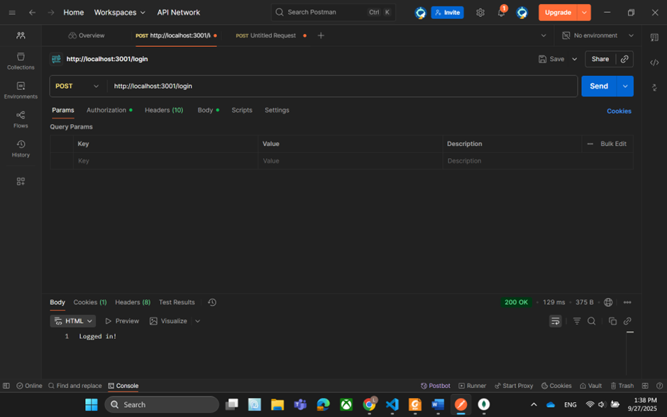

## 1. Basic Authentication (`basic_auth.js`)
### Steps to Test:
1. Run the server:
2. Open Postman and create a GET request to: `http://localhost:3000/`
3. Go to the **Authorization** tab, select **Basic Auth**.
4. Enter:
- Username: `admin`
- Password: `12345`
5. Send the request.
6. Check the response (e.g., 200 OK with "welcome" message).

### Screenshot:

## 2. Cookie Authentication (`cookie_auth.js`)
### Steps to Test:
1. Run the server:
2. Open Postman and create a POST request to: `http://localhost:3001/login`
3. Go to the **Body** tab, select **raw**, and enter JSON:
4. Send the request to set the cookie.
5. Check the **Cookies** tab in Postman to see the cookie (e.g., `auth`).
6. Create a GET request to: `http://localhost:3001/profile` to test the protected route.
7. Send the request and verify the response.

### Show Cookie in MongoDB:
1. Open MongoDB Compass and connect to `localhost:27017`.
2. Select the database (e.g., `cookieApp`) and collection (e.g., `sessions`).
3. Look for the session document containing the cookie data.

